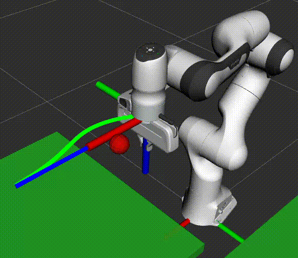
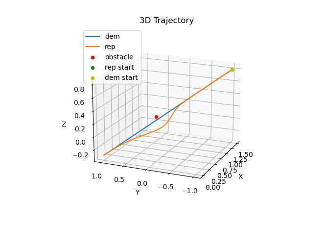

# RS2-DMP-Demo

This repository contains a demo to accompany Dr Victor Hernandez Moreno lecture on Learning from Demonstration and Dynamic Movement Primitives

<p align="center">
    
</p>

## Installation
1. Navigate to your workspace and **clone the repository** into the `src` directory:

   ```sh
   git clone https://github.com/tonydle/RS2-DMP-demo.git src/rs2_dmp_demo
   ```
2. Install Python dependencies:
   ```sh
   pip install -r src/rs2_dmp_demo/cdmp/requirements.txt
   ```
3. Build using colcon with symlink install:

   ```sh
   colcon build --symlink-install
   ```
4. Source the workspace:

   ```sh
   source install/setup.bash
   ```

## Usage
### Quickly Test CDMP
To quickly test the CDMP Python class, run the provided python script:
```sh
python3 src/rs2_dmp_demo/cdmp/test_cdmps.py
```
    
This will run a script with a trajectory read from a text file (`cdmp/demos/minJerk1.txt`), compute the CDMP trajectory, and plot the results using matplotlib.
<p align="center">
    
</p>

### Running the Panda demo
First, launch the modified Panda demo with MoveIt Servo and Rviz
```sh
ros2 launch rs2_dmp_demo panda_dmp_demo.launch.py 
```
Then, in another terminal, run the CDMP ROS node:
```sh
ros2 run rs2_dmp_demo test_cdmp_panda
```

To turn off the effect of repulsive collision avoidance, in `rs2_dmp_demo/test_cdmp_panda.py` set
```python
self.use_collision = False
```