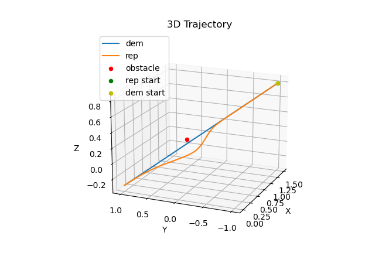
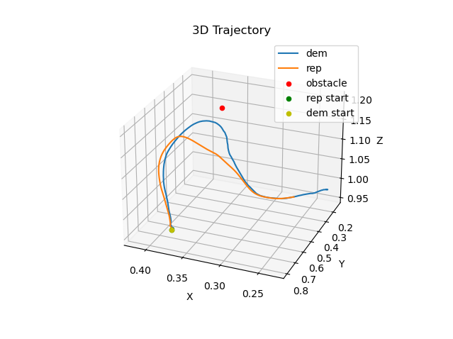
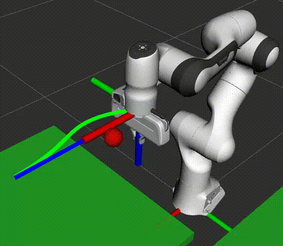

# RS2-DMP-Demo

This repository contains a demo to accompany Dr Victor Hernandez Moreno lecture on Learning from Demonstration and Dynamic Movement Primitives

## Installation
1. Navigate to your workspace and **clone the repository** into the `src` directory:

   ```sh
   git clone https://github.com/tonydle/RS2-DMP-demo.git src/rs2_dmp_demo
   ```
2. Install Python dependencies:
   ```sh
   pip install -r src/rs2_dmp_demo/cdmp/requirements.txt
   ```

3. Install ROS dependencies using rosdep:

   ```sh
   rosdep install --from-paths src/rs2_dmp_demo --ignore-src -r -y
   ```

3. Build using colcon with symlink install:

   ```sh
   colcon build --symlink-install
   ```
4. Source the workspace:

   ```sh
   source install/setup.bash
   ```

## Usage
### Quickly Test CDMP
To quickly test the CDMP Python class, run the provided python script:
```sh
python3 src/rs2_dmp_demo/cdmp/test_cdmps.py
```
    
This will run a script with a trajectory read from a text file, compute the CDMP trajectory, and plot the results using matplotlib.
<p align="center">
    
</p>

To switch between the straight-line demo and a recorded VR demo, edit the `demo_name` variable near the top of [`cdmp/test_cdmps.py`](/home/ynot/humble_ws/src/rs2_dmp_demo/cdmp/test_cdmps.py#L59) and set it to either `minjerk` or `vr`. The obstacle position and repulsion-force tuning now switch with the demo as well.

<p align="center">
  
  
</p>

### Running the Panda (MoveIt Servo) demo
First, launch the modified Panda demo with MoveIt Servo and Rviz
```sh
ros2 launch rs2_dmp_demo panda_dmp_demo.launch.py 
```
Then, in another terminal, run the CDMP ROS node:
```sh
ros2 run rs2_dmp_demo test_cdmp_panda
```

To turn off the effect of repulsive collision avoidance, in `rs2_dmp_demo/test_cdmp_panda.py` set
```python
self.use_collision = False
```

<p align="center">
    
</p>

### Extra: Recording a trajectory from a `PoseStamped` topic
If you want to create a trajectory file (e.g., from a VR controller or headset), you can record any `geometry_msgs/msg/PoseStamped` topic into the same CSV format used by `cdmp/demos/minJerk1.txt`.

Run the recorder directly:
```sh
ros2 run rs2_dmp_demo record_pose_trajectory --ros-args \
  -p pose_topic:=/vr_controller/pose \
  -p output_file:=/tmp/vr_trajectory.txt
```

Or use the launch file:
```sh
ros2 launch rs2_dmp_demo record_pose_trajectory.launch.py \
  pose_topic:=/vr_controller/pose \
  output_file:=/tmp/vr_trajectory.txt
```

Move the tracked device, then stop the node with `Ctrl+C`. The file will be written with:
```text
TimeStep,PosX,PosY,PosZ,QuatW,QuatX,QuatY,QuatZ
```

Useful parameters:
- `pose_topic`: Topic to subscribe to.
- `output_file`: Destination for the recorded trajectory.
- `use_msg_stamp`: Use `PoseStamped.header.stamp` instead of local receipt time.
- `min_translation_delta`: Skip samples unless position changes by at least this many meters.
- `min_rotation_delta_rad`: Skip samples unless orientation changes by at least this many radians.
- `max_samples`: Stop automatically after a fixed number of saved samples. `0` means unlimited.
